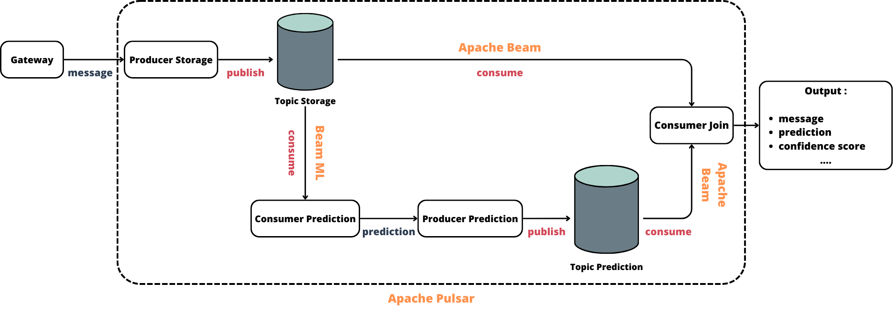

# Pipeline de Détection de Messages de Jailbreak


<div align="center">
  
</div> 

<br/>

Ce projet est une pipeline de détection de messages de **Jailbreak** utilisant **Apache Pulsar** et **Beam ML**, développée dans le cadre du projet **INFONUM** à **CentraleSupélec**.

L’objectif est de détecter en temps réel les tentatives de contournement des garde-fous dans des interactions avec des modèles de langage.

## 🚀 Lancement du service

### Prérequis

- Docker
- Docker Compose

### Étapes

1. Dans un premier terminal, lancez Pulsar :

```bash
  docker compose -f 'Jailbreak-Detection/docker-compose.yaml' up -d --build pulsar
```
2. Dans un second terminal, lancez la passerelle (gateway) :

```bash
  docker compose -f 'Jailbreak-Detection/docker-compose.yaml' up -d --build gateway
```
## 🔁 Mise à jour en direct du modèle (Live update modèle)
Le système permet de mettre à jour les poids du modèle en direct, sans redémarrage manuel.

### Fonctionnement
Un file watcher surveille les fichiers de poids du modèle.

Lorsque vous remplacez les poids (par exemple, en copiant un nouveau fichier avec le même nom ou en le réécrivant), la date de dernière modification change.

Le file watcher détecte ce changement automatiquement.

Le modèle est alors rechargé dynamiquement avec les nouveaux poids.

Exemple :
```bash
  cp nouveaux_poids.safetensor production/poids.safetensor
```
## 👥 Auteurs
Projet réalisé dans le cadre du cours INFONUM à CentraleSupélec.

